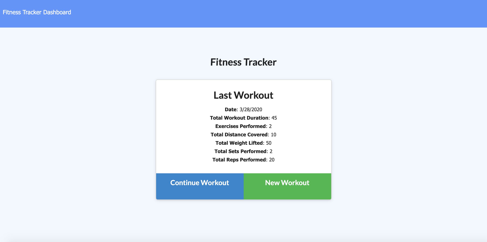
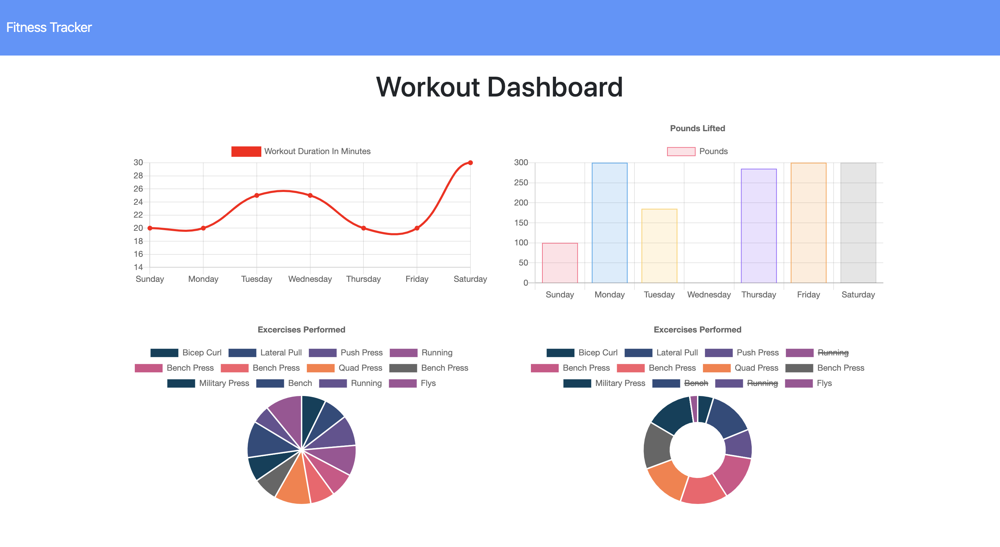
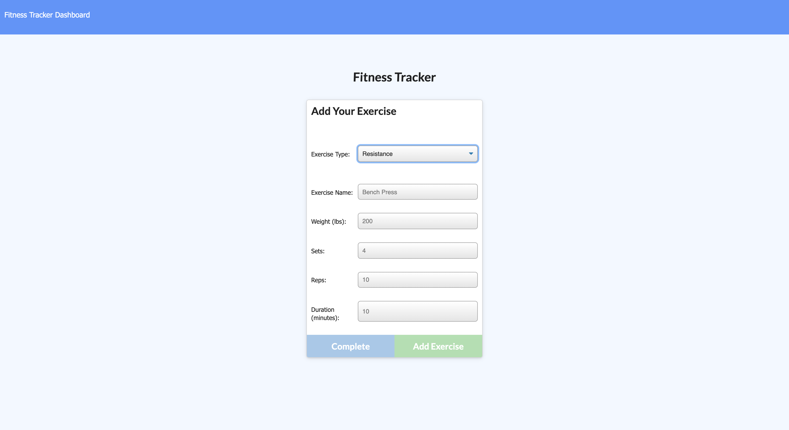

# Mongo-Fitness-Tracker
This application primarily uses a Mongo DB, Mongoose Schema, and Express.js to allow a user to view, create, and track daily workouts.

## Utilizing the App

- You can access the deployed application on Heroku: [Here](https://quiet-scrubland-79228.herokuapp.com/ "Here")
- When the user loads the page, they are given the option to create a new workout, or continue with their last workout. The user is able to:
  - Add exercises to a previous workout plan.
  - Add new exercises to a new workout plan.
  - View multiple the combined weight of multiple exercises on the stats page.

## Demo Images

## Tech used

- HTML
- CSS
- Bootstrap
- Javascript
- Node.js
- Express
- MongoDB
- Mongoose
- Morgan
- mLab

## Contributers

- Jordan Smith